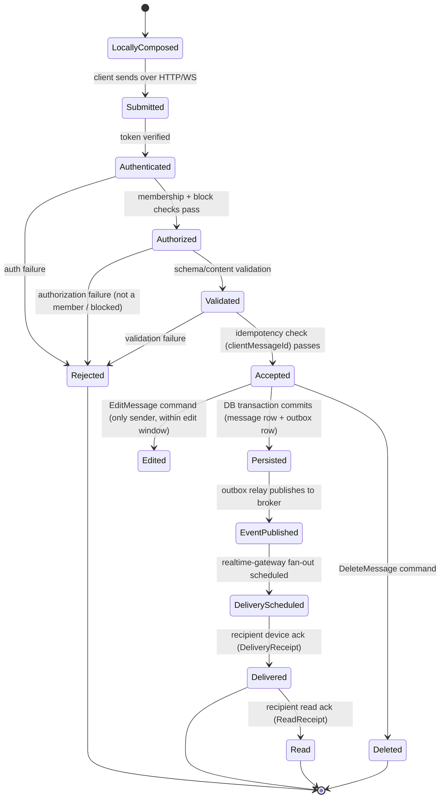

# 03 — Canonical Domain Model, Identifiers, and Message Lifecycle

## 1. Identifier Conventions (Cross-Part Contract)

| Identifier type | Format | Generated by | Durable? | Purpose |
|---|---|---|---|---|
| Entity ID (all durable entities) | UUIDv7 (time-ordered UUID), string, lowercase, hyphenated | Server (database default or application layer) | Yes | Primary key; time-ordered UUIDv7 preserves index locality unlike UUIDv4 |
| Client message ID (`clientMessageId`) | UUIDv4, client-generated | Client | Yes (stored alongside server ID) | Idempotency key for message submission; survives retries across network failure |
| Server message ID (`id`) | UUIDv7 | Server | Yes | Authoritative message identifier used everywhere after acceptance |
| Idempotency-Key (HTTP header) | Client-generated UUIDv4, required on all unsafe (POST/PATCH/DELETE) endpoints that create durable state | Client | Stored for 24h in `IdempotencyRecord` table | Generic request-level dedup, independent of `clientMessageId` |
| Correlation ID | UUIDv4, generated at the edge if absent | Edge or client | Not persisted long-term; propagated through logs/traces/events for the life of a request | Cross-system tracing of one logical operation |
| Trace ID / Span ID | W3C Trace Context (`traceparent` header) | OpenTelemetry SDK | Not persisted; exported to tracing backend | Distributed tracing |
| Session ID | UUIDv7 | Server | Yes | Identifies one authenticated device session |
| Device ID | UUIDv4, generated client-side on first install, sent at registration | Client | Yes | Stable per-install identity used for multi-device sync and push targeting |
| Event ID | UUIDv7 | Producer (server) | Yes (event log retention window) | Dedup key for event consumers |

**Rule**: `clientMessageId` and `Idempotency-Key` are distinct concepts. `clientMessageId` is
specific to message submission and is stored permanently as part of the message record (so a
client can reconcile its optimistic local copy with the server copy). `Idempotency-Key` is a
generic short-lived dedup mechanism for any mutating request and is not part of the resulting
resource's identity.

## 2. Timestamp Convention

All timestamps are ISO-8601 UTC with millisecond precision (`2026-09-16T14:32:07.123Z`), stored
in Postgres as `timestamptz`. Clients must not assume server-received timestamp equals
client-composed timestamp; both are recorded separately:

- `clientComposedAt` — client's local clock at composition (untrusted, display-hint only).
- `serverAcceptedAt` — authoritative, set by `core-api` at persistence, used for all ordering.

## 3. Canonical Entities

### 3.1 User (Identity domain)
```
User {
  id: UUID
  handle: string            // unique, immutable
  status: enum(active, suspended, deleted)
  createdAt: timestamptz
  updatedAt: timestamptz
}
Credential {
  userId: UUID
  type: enum(password, ...)
  secretHash: string        // never logged, never returned in API responses
  updatedAt: timestamptz
}
```

### 3.2 Device / Session (Devices & Sessions domain)
```
Device {
  id: UUID
  userId: UUID
  platform: enum(ios, android, web)
  pushToken: string | null
  firstSeenAt: timestamptz
  lastSeenAt: timestamptz
}
Session {
  id: UUID
  userId: UUID
  deviceId: UUID
  refreshTokenHash: string
  issuedAt: timestamptz
  expiresAt: timestamptz
  revokedAt: timestamptz | null
}
```

### 3.3 Profile (Profiles domain)
```
Profile {
  userId: UUID
  displayName: string
  avatarMediaAssetId: UUID | null
  statusText: string | null
  updatedAt: timestamptz
}
PrivacySetting {
  userId: UUID
  lastSeenVisibility: enum(everyone, contacts, nobody)
  readReceiptsEnabled: boolean
  presenceVisibility: enum(everyone, contacts, nobody)
}
```

### 3.4 Contact / Block (Contacts domain)
```
Contact { ownerId: UUID, contactUserId: UUID, createdAt: timestamptz }
Block { blockerId: UUID, blockedId: UUID, createdAt: timestamptz }
```

### 3.5 Conversation / Group (Conversations / Groups domains)
```
Conversation {
  id: UUID
  type: enum(direct, group)
  createdBy: UUID
  createdAt: timestamptz
  lastMessageAt: timestamptz | null   // denormalized for list sorting
}
GroupMetadata {
  conversationId: UUID
  name: string
  avatarMediaAssetId: UUID | null
  description: string | null
}
GroupMember {
  conversationId: UUID
  userId: UUID
  role: enum(owner, admin, member)
  joinedAt: timestamptz
  invitedBy: UUID | null
  leftAt: timestamptz | null
}
```
`ConversationMember` (generic, used for both direct and group) is the canonical term for
"a user's membership row in a conversation." `GroupMember` is the group-specific specialization
carrying `role`. Direct conversations use a lighter `ConversationMember` row without roles.

### 3.6 Message (Messaging domain)
```
Message {
  id: UUID                       // server-generated, authoritative
  clientMessageId: UUID          // client-generated, idempotency key
  conversationId: UUID
  senderId: UUID
  senderDeviceId: UUID
  type: enum(text, image, video, audio, document, system)
  body: string | null            // text content; null for pure-media messages
  replyToMessageId: UUID | null  // MessageReference
  clientComposedAt: timestamptz
  serverAcceptedAt: timestamptz
  editedAt: timestamptz | null
  deletedAt: timestamptz | null
  deletionScope: enum(none, for_self, for_everyone) | null
  status: enum(accepted, failed)  // "failed" only ever exists transiently client-side; server
                                   // never persists a message it rejected
}
MessageAttachment {
  id: UUID
  messageId: UUID
  mediaAssetId: UUID
  order: int
}
MessageReaction {
  messageId: UUID
  userId: UUID
  emoji: string
  createdAt: timestamptz
}
DeliveryReceipt {
  messageId: UUID
  userId: UUID
  deviceId: UUID
  deliveredAt: timestamptz
}
ReadReceipt {
  messageId: UUID
  userId: UUID
  deviceId: UUID
  readAt: timestamptz
}
```

### 3.7 Media (Media domain)
```
MediaAsset {
  id: UUID
  ownerId: UUID
  originalObjectKey: string
  contentType: string
  sizeBytes: bigint
  status: enum(pending_upload, uploaded, processing, ready, failed, deleted)
  createdAt: timestamptz
}
MediaVariant {
  id: UUID
  mediaAssetId: UUID
  kind: enum(thumbnail, preview, transcoded_video, transcoded_audio, original)
  objectKey: string
  contentType: string
  width: int | null
  height: int | null
  durationMs: int | null
  sizeBytes: bigint
}
```

### 3.8 Notification (Notifications domain)
```
PushToken {
  id: UUID
  userId: UUID
  deviceId: UUID
  provider: enum(apns, fcm, web_push)
  token: string
  createdAt: timestamptz
  invalidatedAt: timestamptz | null
}
NotificationPreference {
  userId: UUID
  mutedConversationIds: UUID[]
  quietHoursStart: string | null   // local time, e.g. "22:00"
  quietHoursEnd: string | null
}
```

### 3.9 Moderation / Audit
```
Report {
  id: UUID
  reporterId: UUID
  targetType: enum(user, message, conversation)
  targetId: UUID
  reason: string
  status: enum(open, reviewed, actioned, dismissed)
  createdAt: timestamptz
}
AuditEvent {
  id: UUID
  actorId: UUID | null            // null for system-initiated
  action: string                  // e.g. "group.role_changed"
  targetType: string
  targetId: UUID
  before: jsonb | null
  after: jsonb | null
  createdAt: timestamptz
}
```

## 4. Enumerations (Canonical Status Values — Cross-Part Contract)

| Enum | Values |
|---|---|
| `ConversationType` | `direct`, `group` |
| `GroupRole` | `owner`, `admin`, `member` |
| `MessageType` | `text`, `image`, `video`, `audio`, `document`, `system` |
| `MessageDeletionScope` | `none`, `for_self`, `for_everyone` |
| `MediaAssetStatus` | `pending_upload`, `uploaded`, `processing`, `ready`, `failed`, `deleted` |
| `AccountStatus` | `active`, `suspended`, `deleted` |
| `ReportStatus` | `open`, `reviewed`, `actioned`, `dismissed` |
| `PresenceState` | `online`, `offline`, `away` (client-hinted only; server never persists `away`) |

Later implementation prompts must reuse these exact enum names and values. Introducing
parallel/renamed enums for the same concept is a compatibility violation.

## 5. Message Lifecycle — Canonical State Machine



### 5.1 Authoritative State Transitions

Only `core-api` (Messaging module) can transition a message from `Submitted` through
`Persisted`. Only the transactional outbox relay can transition `Persisted` → `EventPublished`.
Only `realtime-gateway`, having consumed the event, can attempt `DeliveryScheduled` → `Delivered`
(via device ack). Only the recipient's own device can transition → `Read`.

**A message that is not `Persisted` does not exist** — it is never exposed via any API, event, or
realtime channel before the database transaction (message row + outbox row) commits. This is the
single authoritative "did this message happen" boundary in the whole system.

### 5.2 Retry and Duplicate Behavior

| Scenario | Behavior |
|---|---|
| Client retries `SendMessage` with same `clientMessageId` after timeout/disconnect | Server looks up `(senderId, conversationId, clientMessageId)` unique constraint; if found, returns the existing persisted message (200, not 201) instead of creating a duplicate |
| Connection drops after server persists but before HTTP response is delivered | Message is already `Persisted` and will fan out normally; client's subsequent reconnect/sync will observe it via `GetConversationHistory` or realtime replay, reconciling the optimistic local copy by `clientMessageId` |
| Event broker temporarily unavailable at publish time | Outbox row remains `unpublished`; relay retries with backoff; message stays `Persisted` (durable) even though `EventPublished` is delayed — no data loss, only delivery latency |
| Recipient offline at publish time | `DeliveryScheduled` state persists in a per-recipient pending-delivery record; delivered on next connect via missed-event replay (see `06-realtime-architecture.md` §7) |
| Multiple devices of the same recipient ack delivery | Each `(messageId, userId, deviceId)` receipt is independently idempotent-upserted; "delivered to user" for API purposes is derived as "at least one active device delivered" |
| Duplicate realtime events received by a client (at-least-once broker + at-least-once WS delivery) | Client and `realtime-gateway` both dedup by `eventId`; clients must ignore events with an already-seen `eventId` |
| Out-of-order events for the same conversation | Each event carries `conversationSequence` (monotonic per-conversation counter, see `06-realtime-architecture.md` §4); clients buffer and reorder within a bounded window, or request a resync if a gap persists beyond that window |

### 5.3 Editing and Deletion Semantics

- `EditMessage`: allowed only by `senderId`, only within a configurable edit window (architectural
  default: 15 minutes from `serverAcceptedAt`; the exact value is a product/config decision made
  by the implementation prompt, not fixed here). Produces `message.edited` event; `editedAt` set;
  original `body` is not retained in the primary row (edit history retention, if required by
  product policy, is a separate `MessageEditHistory` table — explicitly out of this volume's
  scope to fully specify).
- `DeleteMessage(for_self)`: creates a per-user tombstone (`MessageDeletionMark` — owned by
  Messaging) that filters the message out of that user's reads only; does not affect other
  recipients; does not emit a fan-out event to other members.
- `DeleteMessage(for_everyone)`: allowed by `senderId` (and, per policy, group
  admins/owners for group conversations) within a configurable window; sets `deletedAt` and
  `deletionScope=for_everyone` on the canonical row, body is nulled, `message.deleted` event
  emitted to all members, and any cached/denormalized read models are invalidated.

## 6. Message Reference Model (Replies)

`replyToMessageId` is a nullable foreign key to another `Message.id` in the **same conversation**
(enforced at write time, not just by convention). If the referenced message is later deleted
for-everyone, the reply retains the reference (`replyToMessageId` unchanged) but the client
renders a "message deleted" placeholder by resolving the referenced message's `deletedAt`.
