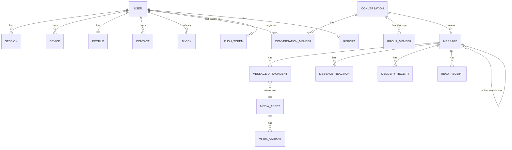

# 04 — Database Architecture (PostgreSQL)

## 1. Logical Schema Strategy

One PostgreSQL cluster, one logical database, **schema-per-domain** (Postgres `SCHEMA`, not
separate databases) to keep the module-boundary rule enforceable and inspectable:

```
identity.*          -- User, Credential, AccountRecoveryRequest
sessions.*           -- Device, Session
profiles.*           -- Profile, PrivacySetting
contacts.*           -- Contact, Block
conversations.*       -- Conversation, ConversationSettings, ConversationMember, GroupMetadata, GroupMember
messaging.*           -- Message, MessageAttachment, MessageReference, MessageDeletionMark, Outbox
receipts.*            -- DeliveryReceipt, ReadReceipt
reactions.*           -- MessageReaction
media.*               -- MediaAsset, MediaVariant
notifications.*       -- PushToken, NotificationPreference
moderation.*          -- Report, ModerationAction, AccountRestriction
administration.*      -- AdminRole
audit.*               -- AuditEvent
analytics.*           -- AnalyticsEvent
```

Each schema has its own least-privilege database role. `core-api`'s connection pool uses a role
per module at the application layer (enforced via Prisma multi-schema / row access patterns), so
a bug in one module's query code cannot read or write another module's tables even before code
review catches an architectural violation.

**Why schema-per-domain instead of database-per-domain**: at current scale, cross-schema
transactions (e.g., Messaging + Audit in one commit) are still needed for a handful of flows, and
a single Postgres transaction cannot span multiple databases without distributed-transaction
complexity. Schemas preserve transactional integrity for these flows while keeping ownership
boundaries explicit and enforceable in migrations and grants.

## 2. Core Entities and Relationships (ERD)



## 3. Critical Constraints

| Table | Constraint | Purpose |
|---|---|---|
| `messaging.message` | `UNIQUE (conversation_id, sender_id, client_message_id)` | Idempotent message submission — enables safe client retry |
| `messaging.message` | `FOREIGN KEY (reply_to_message_id) REFERENCES messaging.message(id)` + application check that it's in the same `conversation_id` | Reply integrity |
| `conversations.conversation_member` | `UNIQUE (conversation_id, user_id)` | One membership row per user per conversation |
| `conversations.group_member` | `CHECK (role IN ('owner','admin','member'))` | Enum enforcement at DB level as defense-in-depth |
| `receipts.delivery_receipt` | `UNIQUE (message_id, user_id, device_id)` | Idempotent delivery ack upsert |
| `receipts.read_receipt` | `UNIQUE (message_id, user_id, device_id)` | Idempotent read ack upsert |
| `contacts.block` | `UNIQUE (blocker_id, blocked_id)` | Idempotent blocking |
| `identity.user` | `UNIQUE (handle)` | Handle uniqueness |
| `sessions.session` | `FOREIGN KEY (device_id) REFERENCES sessions.device(id) ON DELETE CASCADE` | Session cleanup on device removal |
| `messaging.outbox` | `INDEX (published_at) WHERE published_at IS NULL` (partial index) | Fast relay polling for unpublished rows |

## 4. Primary Indexes for High-Volume Access Patterns

Messaging is the dominant write and read path. Indexing decisions:

| Query pattern | Index |
|---|---|
| Paginated conversation history, newest-first | `INDEX (conversation_id, server_accepted_at DESC, id DESC)` — composite, supports keyset pagination |
| "Did this client-message already get accepted?" (idempotency check) | Covered by the `UNIQUE (conversation_id, sender_id, client_message_id)` constraint index |
| "Get all undelivered receipts for a user across devices" | `INDEX (user_id, delivered_at)` on `delivery_receipt`, partial `WHERE delivered_at IS NULL` for pending scans if a durable pending-delivery table is used (see §7) |
| "List conversations for a user, sorted by recency" | Served by the denormalized `conversation_list_view` (see §5), not by scanning `message` |
| "Get a user's group memberships" | `INDEX (user_id)` on `group_member` |
| Outbox relay polling | Partial index on `messaging.outbox (published_at) WHERE published_at IS NULL` |

**Explicitly avoided**: `OFFSET`-based pagination for conversation history and any other
high-volume list. All paginated high-volume endpoints use **keyset (cursor) pagination** on
`(server_accepted_at, id)` — see `05-api-architecture.md` §4. Offset pagination on a
multi-hundred-million-row `message` table degrades linearly with offset depth and is
architecturally disallowed for that table.

## 5. Denormalized Read Models

To avoid expensive cross-domain joins and unbounded scans on hot paths, the following read
models are explicitly owned and maintained by the domain that serves them, kept consistent via
domain events (eventual consistency, bounded staleness target: < 2s p99):

| Read model | Owner | Source events | Purpose |
|---|---|---|---|
| `conversation_list_view` (conversation_id, user_id, last_message_preview, last_message_at, unread_count) | Conversations module | `message.created`, `message.read`, `group.member_added/removed` | O(1) conversation list rendering without joining `message` per row |
| `unread_count` (per user, per conversation, Redis + periodic Postgres reconciliation) | Receipts module | `message.created`, `message.read` | Fast unread badge without scanning receipts |

These read models are **never** treated as authoritative; if they and the source tables disagree,
the source tables win, and a reconciliation job (see `07-events-and-queues.md` §6) periodically
corrects drift.

## 6. Transaction Boundaries

| Operation | Transaction scope |
|---|---|
| `SendMessage` | Single transaction: insert `message` row + insert `outbox` row (transactional outbox — see `07-events-and-queues.md` §1) |
| `CreateConversation` (group) | Single transaction: insert `conversation` + insert `group_metadata` + insert `group_member` rows for initial members + `outbox` row for `conversation.created` |
| `DeleteMessage(for_everyone)` | Single transaction: update `message.deleted_at`/`deletion_scope` + `outbox` row |
| `RegisterAccount` | Single transaction: insert `user` + insert `credential` + `outbox` row for `account.created` (Profiles module creates the default profile asynchronously via the event, not in the same transaction, since it's a different schema/module) |
| Cross-module flows in general | Each module's own state changes transactionally within its own schema; cross-module effects propagate via the outbox/event mechanism, never via a distributed transaction spanning modules |

**Isolation level**: `READ COMMITTED` (Postgres default) for general application queries;
`SERIALIZABLE` or explicit row locking (`SELECT ... FOR UPDATE`) only for the specific
concurrency-sensitive paths identified below.

## 7. Concurrency Controls

| Scenario | Control |
|---|---|
| Two devices of the same sender submit the same `clientMessageId` concurrently (rare race) | Unique constraint on `(conversation_id, sender_id, client_message_id)` causes the second insert to fail with a constraint violation; application catches it and returns the already-persisted row (same as the retry-dedup path) |
| Concurrent `AddMember`/`RemoveMember` on the same group | `SELECT ... FOR UPDATE` on the `conversation` row (or an advisory lock keyed on `conversation_id`) during membership mutation to prevent lost updates to derived counts/roles |
| Concurrent role change vs. removal for the same member | Same advisory lock as above; the losing transaction re-reads post-lock state before applying its change or fails with a conflict the API surfaces as `409 Conflict` |
| High-frequency `ReadReceipt` upserts from bursty clients | `INSERT ... ON CONFLICT (message_id, user_id, device_id) DO UPDATE` — no explicit locking needed, upsert is atomic |

## 8. Migration Strategy

- All schema changes are expressed as versioned, forward-only migrations (Prisma Migrate or
  equivalent), checked into the repository, and applied through CI/CD — never applied by hand
  against production.
- **Expand/contract pattern** for breaking changes: add new column/table (expand) → deploy code
  that writes both old and new → backfill → deploy code that reads only new → remove old
  (contract) in a later migration. No single deploy may both add a `NOT NULL` column without a
  default and require it to be populated atomically across a large existing table.
- Migrations affecting the `messaging.message` table (highest volume) must be reviewed for lock
  duration; use `CREATE INDEX CONCURRENTLY` and avoid `ALTER TABLE ... ADD COLUMN ... NOT NULL`
  without a default on that table.

## 9. Retention, Deletion, and Archival

- **Account deletion**: `account.deleted` event triggers cascading anonymization: `user.handle`
  replaced with a tombstone value, `credential` rows deleted, `message.body` for that sender is
  either retained (if product policy requires conversation integrity for other participants) or
  redacted per policy — this product decision must be made explicit in a later ADR before
  implementation; this volume defines the mechanism (event-driven cascading job in `workers`),
  not the specific redaction policy.
- **Message archival**: `messaging.message` is expected to grow unbounded. Architectural
  provision (not implemented in this volume): time-based partitioning (e.g., monthly range
  partitions on `server_accepted_at`) so that old partitions can be moved to cheaper storage or
  dropped per retention policy without locking the active partition. This is documented as a
  **required future implementation task**, not deferred indefinitely — the schema design in this
  volume already assumes `server_accepted_at`-ordered access patterns compatible with
  partitioning.
- **Audit retention**: `audit.audit_event` is append-only and retained per compliance policy
  (external requirement, not fixed by this architecture); no hard deletes, only cold-storage
  migration.

## 10. Replication and Read Scaling

- **Initial topology**: single primary + at least one synchronous or near-synchronous standby for
  failover (managed Postgres HA, e.g., cloud-provider multi-AZ), plus one or more **read
  replicas** for read-heavy, staleness-tolerant queries.
- **Reads directed to replicas** (architectural guidance, enforced at the data-access layer):
  conversation history pagination beyond the most recent page, search-index rebuild scans,
  analytics queries, admin reporting queries.
- **Reads that must go to the primary**: anything immediately following a write in the same
  logical operation (read-your-writes), all authorization checks, all receipt/idempotency
  lookups.
- Regional read replicas (multi-region) are identified as a **future scalability lever** (see
  `10-consistency-caching-reliability.md` §5) and are explicitly not implemented in this volume.
