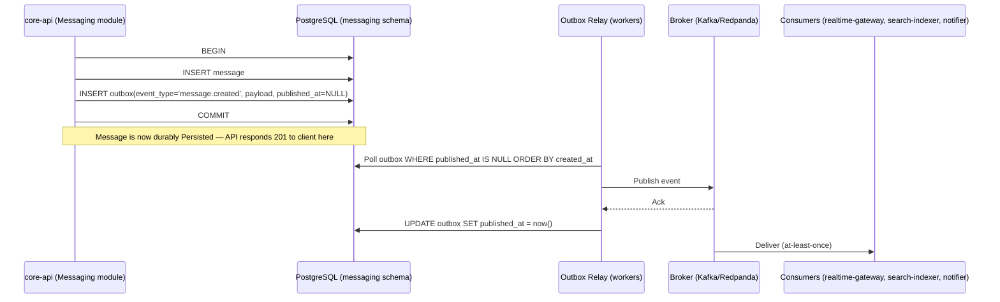

# 07 — Event Architecture and Queue Architecture

## 1. Transactional Outbox Pattern

**Problem**: a domain write (e.g., persisting a message) and publishing the corresponding domain
event must not diverge — if the DB commit succeeds but event publication fails (or vice versa),
downstream consumers (realtime fan-out, search indexing, notifications) silently miss data or act
on data that was never actually committed.

**Solution**: every module that emits domain events writes an `outbox` row in the **same
database transaction** as the state change (see `04-database-architecture.md` §6). A separate,
independent **outbox relay process** (part of `workers`) polls each schema's `outbox` table for
unpublished rows (`published_at IS NULL`), publishes them to the broker in order, and marks them
published — with at-least-once delivery guarantees (the relay may publish and then crash before
marking published, causing a redelivery on restart; this is acceptable because all consumers are
required to be idempotent, see §5).



**Failure sequences and behavior**:

| Failure | Behavior |
|---|---|
| DB commit succeeds, relay crashes before publishing | Row remains `published_at IS NULL`; next relay poll picks it up — no loss, only delayed delivery |
| Relay publishes, crashes before marking `published_at` | Row republished on restart → broker/consumers see a duplicate `eventId`... **wait, this must not create a duplicate eventId** — the relay generates `eventId` deterministically from the outbox row's own primary key (not randomly at publish time), so a redelivery carries the *same* `eventId` and consumers' idempotent dedup (§5) absorbs it |
| Broker temporarily unavailable | Relay retries with bounded exponential backoff; outbox row stays unpublished; durable message data is unaffected |
| Consumer processing fails after receiving the event | Consumer-specific retry/backoff (§6); does not affect the outbox or the durable message |
| Event delivered more than once to a consumer | Consumer must be idempotent (dedup by `eventId`, see §5) — this is a hard requirement, not an optimization |

## 2. Event Envelope (Durable Domain Events — Broker)

This is distinct from, but field-compatible with, the realtime event envelope in
`06-realtime-architecture.md` §4 (the realtime envelope is a superset/transformation of this one,
adding `conversationSequence` computed by `core-api` at outbox-write time and stored in the
outbox row itself so both the durable event and the realtime notification carry the same value).

```json
{
  "eventId": "018f3d00-....",
  "eventType": "message.created",
  "eventVersion": 1,
  "aggregateType": "Message",
  "aggregateId": "018f3b2a-....",
  "producer": "core-api",
  "occurredAt": "2026-09-16T14:31:56.412Z",
  "correlationId": "b3a1c2e0-....",
  "traceContext": "00-4bf92f3577b34da6a3ce929d0e0e4736-00f067aa0ba902b7-01",
  "schemaVersion": 1,
  "payload": { }
}
```

## 3. Canonical Domain Event Catalog

| Event type | Producer | Payload summary | Primary consumers |
|---|---|---|---|
| `account.created` | Identity | userId, handle | Profiles (create default profile) |
| `account.suspended` / `account.deleted` | Identity | userId | Devices/Sessions (revoke), Notifications (cleanup), Audit |
| `session.created` / `session.revoked` | Devices & Sessions | sessionId, userId, deviceId | Realtime Gateway (force disconnect on revoke), Audit |
| `profile.updated` | Profiles | userId, changed fields | Search (re-index), caches |
| `contact.blocked` / `contact.unblocked` | Contacts | blockerId, blockedId | Messaging (authz cache invalidation), Groups |
| `conversation.created` | Conversations | conversationId, type, createdBy | Search, Realtime Gateway |
| `conversation.settings_updated` | Conversations | conversationId | Realtime Gateway |
| `group.member_added` / `group.member_removed` | Groups | conversationId, userId, role | Realtime Gateway (authz cache), Notifications, Search |
| `group.role_changed` | Groups | conversationId, userId, newRole | Audit, Realtime Gateway |
| `message.created` | Messaging | full message payload | Realtime Gateway, Notifications, Search |
| `message.edited` | Messaging | messageId, new body | Realtime Gateway, Search |
| `message.deleted` | Messaging | messageId, scope | Realtime Gateway, Search, Media (cleanup eligibility) |
| `message.delivered` / `message.read` | Receipts | messageId, userId, deviceId | Realtime Gateway, unread-count read-model updater |
| `message.reaction_added` / `message.reaction_removed` | Reactions | messageId, userId, emoji | Realtime Gateway |
| `media.upload_completed` | Media | mediaAssetId | media-processor (workers) |
| `media.processing_completed` / `media.processing_failed` | media-processor | mediaAssetId, variants | Messaging (attach variants), Realtime Gateway |
| `report.filed` | Moderation | reportId | Administration, Audit |
| `moderation.action_applied` | Moderation | targetType, targetId, action | Realtime Gateway (e.g., force-remove from conversation), Audit |

**Rule**: events are created only for meaningful domain/integration boundaries, never as a
substitute for an in-process method call within the same deployment unit.

## 4. Topic and Partitioning Strategy

- One broker topic per aggregate type (`messages`, `conversations`, `groups`, `accounts`,
  `sessions`, `media`, `moderation`), each carrying its own event subtypes rather than one topic
  per event type, to keep ordering guarantees meaningful (see below) without an unmanageable
  topic count.
- **Partition key**: `conversationId` for `messages` topic events (guarantees ordering of all
  events within one conversation, which is the ordering guarantee that actually matters for
  client-side `conversationSequence` correctness); `userId` for account/session events;
  `mediaAssetId` for media events.
- **Retention**: bounded (e.g., 7 days) — the broker is a delivery mechanism and short-term replay
  buffer, not a permanent event store; Postgres is the permanent record. This directly supports
  the "no false completeness" requirement: the architecture never claims the broker is a durable
  audit log.

## 5. Idempotency and Deduplication for Consumers

Every consumer (realtime-gateway fan-out, search-indexer, notifier, media-processor) maintains a
dedup mechanism keyed on `eventId`:

- **realtime-gateway**: in-memory bounded LRU per connection is a client-side concern (see
  `06-realtime-architecture.md` §4); the gateway's own broker consumer relies on the broker's
  consumer-group offset commit for at-least-once semantics and does not need a separate dedup
  store, since duplicate fan-out to a client is handled by the client's own `eventId` dedup.
- **search-indexer / notifier / media-processor** (workers with side effects on external systems
  or durable state): use an `IdempotencyRecord(eventId, consumerName, processedAt)` table (or a
  Redis `SETNX`-based short-TTL guard, backed by the DB table for anything requiring durability
  beyond the TTL) — check-before-process, record-after-success, all within the same transaction
  as any state mutation the consumer performs.

## 6. Queue Architecture (Background Jobs)

| Job category | Queue | Producer | Consumer | Retry policy | Idempotency | Priority |
|---|---|---|---|---|---|---|
| Media processing (transcode/thumbnail) | `media-processing` | Media module (on `media.upload_completed`) | `media-processor` | Exponential backoff, max 5 attempts, then dead-letter | `mediaAssetId` + variant kind as dedup key | Normal; large video jobs on a separate sub-queue from thumbnails so thumbnails aren't starved |
| Push notification delivery | `notification-delivery` | Notifications module (on `message.created`, `group.member_added`) | `workers` | Exponential backoff, max 8 attempts (push providers are flaky), dead-letter after | `(eventId, pushTokenId)` dedup key | Normal |
| Search indexing | `search-indexing` | Search module (on `message.*`, `conversation.*`, `group.*`) | `workers` | Exponential backoff, max 5 attempts, dead-letter | `(eventId)` dedup key, upsert semantics into index (naturally idempotent) | Low (best-effort staleness tolerated) |
| Retention/cleanup | `retention-cleanup` | Scheduled trigger (cron-style) | `workers` | Bounded retry per batch; failures logged, do not block next scheduled run | Batch operations are naturally idempotent (delete-if-eligible) | Low, off-peak scheduling preferred |
| Reconciliation (read-model drift correction) | `reconciliation` | Scheduled trigger | `workers` | Bounded retry; alert on repeated failure | Recomputation is idempotent by construction | Low |
| Account deletion cascade | `account-deletion` | Identity module (on `account.deleted`) | `workers` | Exponential backoff, max 10 attempts, dead-letter with alert (must not silently fail — compliance-relevant) | `userId` dedup key, each step checks current state before acting | High |

### Dead-Letter Handling

Every queue has a corresponding dead-letter queue. Dead-lettered jobs are never silently dropped:
they are retained, logged with full context (job payload, error, attempt count, correlation ID),
and surfaced via an operational metric/alert (see `11-observability.md`) for manual or automated
remediation. Non-idempotent operations are never blindly retried without a compensating check —
each job handler is required to first check whether its effect has already been applied (e.g.,
"is this media asset already in `ready` state?") before performing side effects, precisely
because retries and duplicate deliveries are expected, not exceptional.

## 7. Event Schema Compatibility Strategy

- **Additive-only within a `schemaVersion`**: new optional fields may be added without bumping
  `schemaVersion`; consumers must ignore unknown fields.
- **Breaking changes** (field removal, type change, semantic change) require a `schemaVersion`
  bump and, during the migration window, the producer publishes both versions (or a
  version-negotiated single stream with consumers upgraded first) — the same expand/contract
  discipline as database migrations (`04-database-architecture.md` §8).
- Event payload schemas are defined as shared TypeScript types/JSON Schema in a package
  consumable by both `core-api` (producer) and `workers`/`realtime-gateway` (consumers) to prevent
  drift — this shared-schema package is a portable cross-part contract that later implementation
  prompts must create and both sides must import rather than redefine independently.
