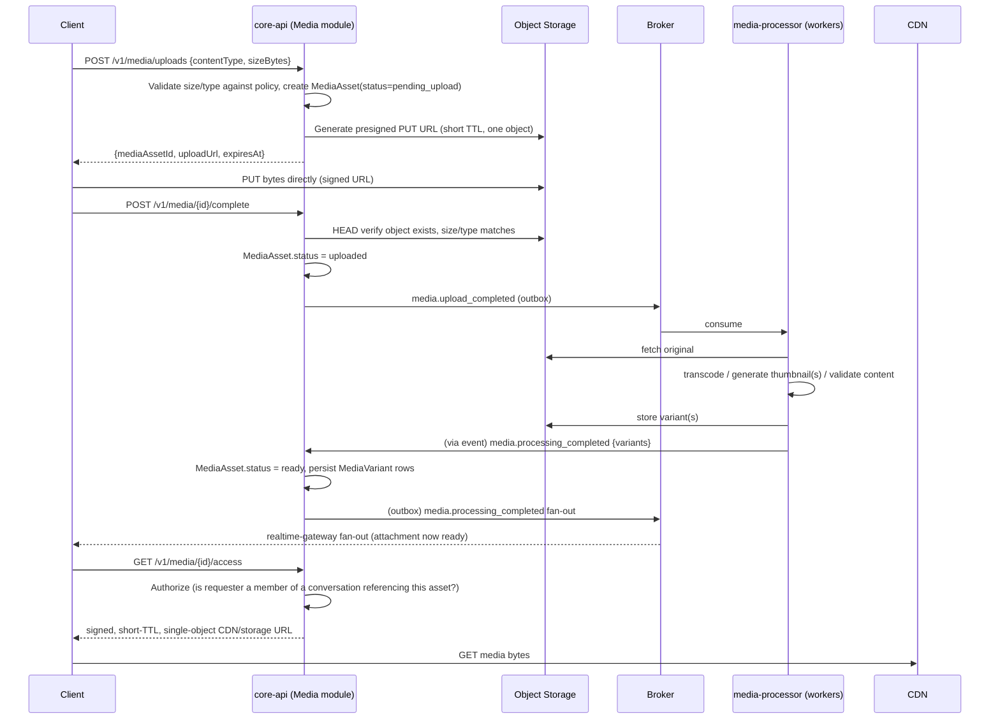
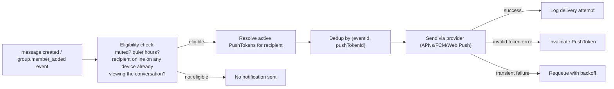

# 08 — Media, Search, and Notification Architecture

## 1. Media Architecture

### 1.1 Flow

### 1.2 Key Decisions

- **Upload authorization**: clients never receive long-lived or broad object-storage credentials.
  Every upload uses a presigned URL scoped to exactly one object key, one HTTP method, and a
  short TTL (architectural default: 15 minutes). Every download similarly uses a
  short-TTL (architectural default: 10 minutes) signed URL, re-issued per access, never a
  permanent public URL.
- **Object-key strategy**: `{env}/{ownerId}/{mediaAssetId}/original.{ext}` for originals,
  `{env}/{ownerId}/{mediaAssetId}/variants/{kind}.{ext}` for variants — predictable, namespaced
  per owner to simplify bucket policy scoping and lifecycle rules, never guessable from a
  sequential ID (UUIDs throughout).
- **Metadata ownership**: `MediaAsset`/`MediaVariant` rows are owned by the Media module in
  Postgres; the bytes are owned by Object Storage. Neither is authoritative for the other alone —
  a `MediaAsset` row with no corresponding object is treated as `failed`/invalid by a periodic
  reconciliation job.
- **Processing states**: `pending_upload → uploaded → processing → ready | failed`. A message
  referencing an attachment whose `MediaAsset` is not yet `ready` is still sendable (product
  decision: optimistic — the message row and attachment reference are created immediately;
  clients render a "processing" placeholder until the `media.processing_completed` fan-out event
  arrives), because gating message send on transcoding completion would create unacceptable
  latency for large media.
- **CDN interaction**: `ready` variants are served through a CDN in front of Object Storage, with
  the CDN itself never receiving public unauthenticated cache keys for private media — the signed
  URL's query-string signature is part of the cache key, and TTLs are kept short enough that CDN
  caching provides throughput benefit without meaningfully extending the effective access window
  beyond the signed URL's own expiry.
- **Cleanup and deletion**: `message.deleted` (for-everyone) and `account.deleted` events
  trigger a `workers` job that marks referenced `MediaAsset`s for deletion review; because an
  asset may be referenced by more than one message context in principle (forwarded media — not
  implemented in this volume but architecturally anticipated), deletion is reference-counted, not
  immediate-on-first-delete-event, avoiding accidental removal of still-referenced bytes.
- **Abuse controls**: size limits and content-type allow-lists enforced both at presigned-URL
  issuance (reject before upload) and at `complete` verification (reject after upload if the
  actual object doesn't match declared metadata); malware/unsafe-file scanning is identified as a
  required processing-pipeline step whose specific vendor/mechanism is an implementation-prompt
  decision, not fixed here.

## 2. Search Architecture

### 2.1 Principle

The search index (OpenSearch/Elasticsearch) is **never** an authorization boundary and **never**
an authoritative data source. It is a derived, eventually-consistent read model over data owned
by Messaging, Conversations, and Contacts.

### 2.2 Indexed Entities

| Search document type | Source of truth | Indexed fields | Authorization filtering |
|---|---|---|---|
| Message | `messaging.message` | conversationId, senderId, body (text-analyzed), type, serverAcceptedAt | Query is pre-scoped to `conversationId IN (caller's membership set)`, resolved from `core-api` at query time — not trusted from the index alone |
| Conversation | `conversations.conversation` + `group_metadata` | conversationId, name/participants (for group search), type | Same membership pre-scoping |
| Contact/Profile | `profiles.profile` | userId, displayName, handle (privacy-filtered fields only) | Filtered by requester's contact relationship + target's `PrivacySetting` |

### 2.3 Indexing Triggers and Consistency

- Indexing is **event-driven** (consumes `message.created/edited/deleted`,
  `conversation.created`, `group.member_removed`, `profile.updated` — see
  `07-events-and-queues.md` §3), not a batch nightly job, to keep staleness bounded.
- **Bounded staleness target**: p99 < 5 seconds from event publication to index visibility.
  Documented as a target, not a guaranteed SLA.
- **Deletion propagation**: `message.deleted` (for-everyone) triggers an index document delete
  (or a `deleted: true` soft-flag filtered out at query time, implementation's choice) — a
  deleted message must never appear in search results, even if the delete-consumer job is delayed
  (the consumer's retry policy from `07-events-and-queues.md` §6 ensures eventual removal, and the
  query-time membership/deletion filter provides defense-in-depth).
- **Rebuild strategy**: a full reindex job (reading from Postgres, the source of truth) can be
  triggered manually or after detected drift; reindexing never reads from the search cluster
  itself as a source.

### 2.4 Query Boundary

`SearchMessages(userId, query)` always performs, server-side, in this order: (1) resolve the
caller's current authorized `conversationId` set from `core-api` (short-TTL cached), (2) execute
the search query pre-filtered to that set, (3) never return a result whose `conversationId` is
outside that set even if the index is briefly stale and still contains a since-removed
membership's data — the filter is applied at query time against **current** authoritative
membership, not against membership as it was when the document was indexed.

## 3. Notification Architecture

### 3.1 Flow

### 3.2 Key Decisions

- **Push-token ownership**: `PushToken` rows are owned by the Notifications module (Postgres),
  keyed by `(userId, deviceId, provider)`, with `invalidatedAt` set (never hard-deleted
  immediately, for audit/debugging) when a provider reports the token as invalid.
- **Eligibility evaluation**: performed once per event per recipient, considering
  `NotificationPreference` (muted conversations, quiet hours) and a best-effort "already actively
  viewing this conversation" signal from presence (if the recipient has a live connection with an
  active subscription to that conversation, the notification is suppressed for that device only —
  other devices still notified) — this is an optimization, not a correctness requirement; a
  missed suppression (double notification) is acceptable, a missed *delivery* is not.
- **Deduplication**: `(eventId, pushTokenId)` — the same underlying domain event never triggers
  two notification sends to the same token, even if the consumer job is retried.
- **Delivery retries**: transient provider errors (5xx, timeout) are retried with backoff up to a
  bounded attempt count; permanent errors (invalid/unregistered token) immediately invalidate the
  token and do not retry.
- **Privacy**: notification payload content is configurable between "full preview" (sender +
  message text) and "generic" ("New message") per `NotificationPreference` or platform-level user
  setting — the architecture supports both; the default is a product decision made outside this
  volume.
- **Rate limiting**: per-recipient notification burst limiting (e.g., collapse many rapid group
  messages into a summarized notification) is identified as a required behavior for group-chat
  usability; the specific batching algorithm is an implementation-prompt decision — this volume
  establishes that the Notifications module must support event coalescing, not the exact
  coalescing window.
- **Observability**: every send attempt is logged (`NotificationDeliveryLog` — success/failure/
  provider response code) for delivery-rate monitoring, without logging message body content in
  the delivery log beyond what's needed for the payload the provider itself received.
