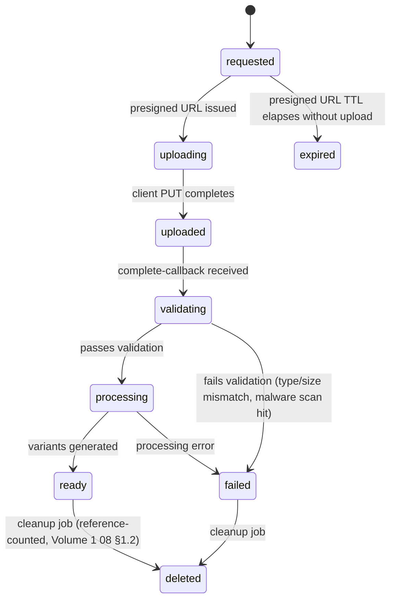

# 20 — Media Contract and Media Security

This document deepens Volume 1 `08-media-search-notifications.md` §1 into a binding lifecycle and
security contract.

## 1. Media Asset Lifecycle States (Canonical, Fixed)



| State | Meaning | Who transitions it |
|---|---|---|
| `requested` | `MediaAsset` row created, presigned upload URL issued, no bytes yet | `core-api` (Media module), on `POST /v1/media/uploads` |
| `uploading` | Optional intermediate state some implementations track via upload-progress signals; not required if the client goes straight from `requested` to calling `complete` | Client-signaled (optional) |
| `uploaded` | Object confirmed present in storage, matching declared `contentType`/`sizeBytes` | `core-api`, on `POST /v1/media/{id}/complete`, after a storage `HEAD` verification |
| `validating` | Content-sniffing / MIME verification / malware scan in progress | `media-processor` |
| `processing` | Transcoding/thumbnailing in progress | `media-processor` |
| `ready` | All required variants generated and persisted | `media-processor` → event → `core-api` persists `MediaVariant` rows, sets `status = ready` |
| `failed` | Validation or processing failed | `media-processor` or `core-api` (validation step) |
| `expired` | Presigned URL TTL elapsed with no upload ever completing | Scheduled cleanup job (`workers`) — `requested` rows older than the presigned URL TTL + grace period are swept |
| `deleted` | Bytes and metadata removed | Cleanup job, reference-counted (Volume 1 `08-...md` §1.2) |

## 2. Upload Initiation and Authorization

`POST /v1/media/uploads`:
```json
{ "contentType": "image/jpeg", "sizeBytes": 2456123, "checksum": "sha256:....", "conversationId": "018f3a10-...." }
```

| Field | Validation |
|---|---|
| `contentType` | Must be in the platform's content-type allow-list per media category (images: `image/jpeg`, `image/png`, `image/webp`, `image/heic`; video: `video/mp4`, `video/quicktime`; audio: `audio/mpeg`, `audio/aac`, `audio/mp4`; documents: an explicit allow-list, e.g. `application/pdf`, common office formats — executable/script MIME types are never allow-listed) |
| `sizeBytes` | Must not exceed the per-category limit (config-driven, `25-configuration-and-secrets.md`; e.g., images 25MB, video 200MB, documents 100MB — architectural defaults, product-configurable) |
| `checksum` | Optional client-supplied SHA-256; if provided, verified post-upload against the actual object as an integrity check (not a security control by itself, since a malicious client controls both the checksum and the bytes, but useful for corruption detection) |
| `conversationId` | Optional at initiation (a media asset may be uploaded before the message that will reference it is composed); if supplied, authorization checks the requester is a current member — this is advisory at upload time and is **re-checked authoritatively** at message-send time (the message references the `mediaAssetId`, and `SendMessage`'s existing membership check governs actual message visibility, per Volume 1 `03-...md` §7's synchronous dependency on the Media module for attachment validation) |

Response includes `uploadUrl` (presigned `PUT`, single object, TTL 15 minutes) and `mediaAssetId`.

## 3. Object Key Strategy (Reaffirmed and Fixed)

`{env}/{ownerId}/{mediaAssetId}/original.{ext}` and
`{env}/{ownerId}/{mediaAssetId}/variants/{kind}.{ext}`, where `{ext}` is derived server-side from
the validated `contentType` (never taken verbatim from a client-supplied filename, to avoid
extension-based content-type confusion/spoofing attacks).

## 4. Metadata and Checksum

- `MediaAsset.sizeBytes` and `contentType` are re-verified against the actual uploaded object at
  `complete` time (storage `HEAD` request) — the client-declared values at `requested` time are
  provisional and never trusted for authorization/quota purposes until this re-verification
  passes.
- Content-sniffing (inspecting actual byte signatures, not just trusting the HTTP
  `Content-Type` header the client set on the `PUT`) is performed during `validating` — a file
  whose sniffed type does not match its declared `contentType` transitions to `failed` with
  `MEDIA_CONTENT_TYPE_MISMATCH`, closing the MIME-spoofing attack surface.

## 5. Processing Jobs and Variants

Reaffirmed from Volume 1 `08-...md` §1: `media-processing` queue, per-media-type sub-queues
(large video isolated from thumbnails), idempotent by `(mediaAssetId, variantKind)`. Variant kinds
per type:

| Media type | Variants generated |
|---|---|
| image | `thumbnail` (small, for chat bubble/list preview), `preview` (medium, for tap-to-view), `original` (untouched, access-controlled same as others) |
| video | `thumbnail` (single frame), `transcoded_video` (normalized codec/bitrate for broad playback compatibility), `original` |
| audio | `transcoded_audio` (normalized codec, e.g., for voice messages), `original` |
| document | `thumbnail` (first-page preview, where feasible), `original` |

## 6. Access Control (Deepened)

`GET /v1/media/{mediaAssetId}/access?variant=thumbnail`:

1. Authenticate requester.
2. Look up `MediaAsset`; find all `MessageAttachment` rows referencing it; for each, resolve the
   owning `Message.conversationId`.
3. Authorize: requester must be a **current** member (`leftAt IS NULL`) of at least one such
   conversation. (An asset referenced by a message in a conversation the requester has since left
   is no longer accessible to them, even though the message/asset itself still exists for
   remaining members — membership is re-checked at access time, not cached from message-read
   time.)
4. If authorized, issue a short-TTL (10 minute default) signed URL for the requested variant.
5. If not authorized: `404 MEDIA_NOT_FOUND` (existence-hiding, consistent with
   `15-...md` §3.1's `CONVERSATION_NOT_FOUND` pattern — media existence is exactly as sensitive
   as conversation existence, since it's scoped by the same membership).

### 6.1 Direct Storage Exposure Prevention

The object storage bucket has **no public read access** at the bucket-policy level; the only path
to bytes is a signed URL minted by step 4 above. This is enforced at the infrastructure layer
(bucket policy — an infrastructure-prompt deliverable) but is an architectural requirement stated
here so no later implementation accidentally makes the bucket public "for CDN convenience."

### 6.2 Media Enumeration Prevention

`mediaAssetId` is a UUIDv7 — not sequential/guessable — and even if guessed, step 3's
authorization check prevents unauthorized access. There is no endpoint that lists media assets
without conversation-scoping (no "browse all media" admin-less endpoint), preventing bulk
enumeration.

### 6.3 Deletion Races

If a delete-for-everyone (`17-...md` §5.2) races with an in-flight `GET .../access` request: the
access request either completes with a URL that then 404s at the storage layer (if deletion's
cleanup job already removed the object — acceptable, matches user intent that the content is
gone) or succeeds normally (if the request's authorization check completed before the message
row's `deletedAt` was set) — there is no window where an *unauthorized* party gains access due to
this race, only a benign race between "was this authorized-at-the-time access request served
slightly before or after a deletion the user themselves initiated," which has no security
implication.

## 7. Resource Exhaustion and Abuse Controls

| Control | Mechanism |
|---|---|
| Oversized files | Rejected at initiation (`sizeBytes` check) and re-verified at `complete` |
| Upload flooding | Per-account rate limit on `POST /v1/media/uploads` (`15-...md` §7 rate-limit categories) |
| Storage quota abuse | Per-account cumulative storage quota, enforced at initiation (`core-api` sums the account's non-deleted `MediaAsset.sizeBytes` before issuing a new presigned URL; exceeding quota returns `422 MEDIA_QUOTA_EXCEEDED`) |
| Malicious uploads (malware) | Validation-stage scanning step (vendor/mechanism is an implementation-prompt decision, per Volume 1 `08-...md` §1.2) — a `failed` result never reaches `ready`, and the object is never exposed via signed URL while in `validating`/`failed` state (access-control check in §6 additionally requires `status == ready` before issuing a signed URL, as defense-in-depth beyond the processing pipeline itself) |
| Zip-bomb / decompression attacks on document previews | Preview/thumbnail generation for documents runs in the isolated `media-processor` pool with resource limits (CPU/memory/time caps per job), so a malicious document cannot exhaust shared infrastructure — an implementation-prompt-level sandboxing requirement, architecturally mandated here by the pool isolation decision in Volume 1 `02-...md` §2 |
