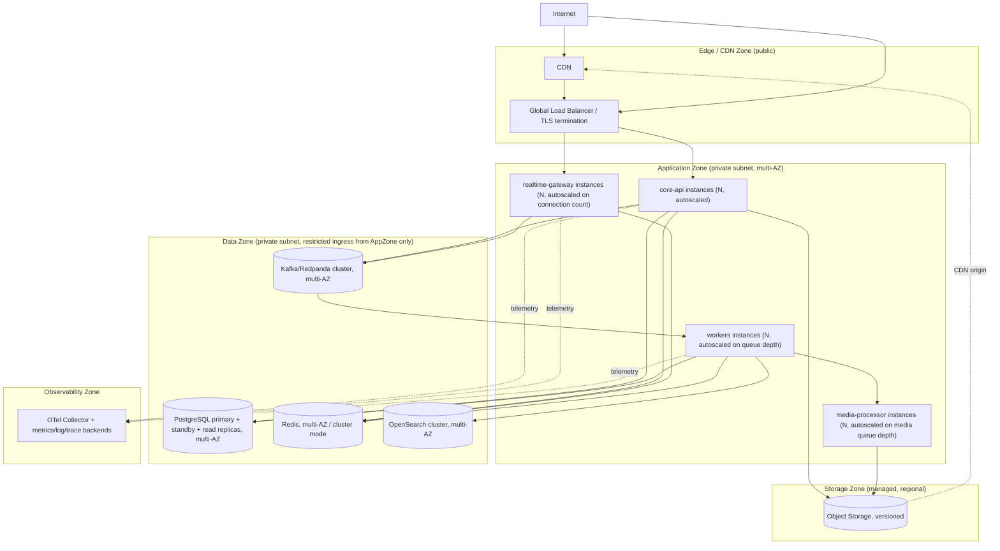

# 26 — Deployment Topology, Environment Model, Regional Architecture, Capacity Model, SLOs

## 1. Deployment Topology (Architecture-Level)

### 1.1 Trust Zones (Reaffirmed from Volume 1, Mapped to Network Boundaries)

| Zone | Network boundary | Ingress allowed from |
|---|---|---|
| Edge/CDN | Public internet-facing | Anyone (TLS-terminated, rate-limited) |
| Application | Private subnet | Only the Load Balancer (for `core-api`/`realtime-gateway`) and the Broker (for `workers`/`media-processor`); no direct public ingress to any application-tier instance |
| Data | Private subnet, most restricted | Only Application-zone service identities, on specific ports, with credential-based auth; no ingress from Edge zone at all, ever |
| Storage (Object Storage) | Managed service, accessed via signed URLs (client-direct for upload/download) or IAM-scoped API calls (application-tier for URL issuance) | Clients only via signed URL (time-boxed, single-object); application tier via IAM role for issuance/management operations |
| Observability | Private, receives telemetry push from all application-tier services | Application-tier services (outbound only from their perspective) |

## 2. Environment Model

| Environment | Purpose | Isolation | Data policy | Deployment policy | Observability |
|---|---|---|---|---|---|
| Local | Individual developer iteration | Fully isolated (local containers, no shared state) | Synthetic/seed data only | Manual, no CI gate | Local logs only, no central export |
| Development (shared dev) | Integration testing across features before CI | Isolated from staging/production data stores | Synthetic/seed data only | Auto-deployed from a development branch/trunk | Lightweight, short retention |
| CI/Test | Automated test execution | Fully ephemeral per pipeline run (fresh database/queue instances, torn down after) | Synthetic, generated per test run | Triggered per commit/PR | Test-run logs only, short retention |
| Staging | Pre-production validation, matches production topology at smaller scale | Fully isolated secrets/data from production (§`25-...md` §5.1) | Synthetic or anonymized data only — **production data is never copied into staging without an explicit, separately-approved anonymization/safeguard process**, per the master prompt's explicit requirement | Deployed from a release-candidate branch/tag, gated by CI passing | Full observability stack, mirroring production configuration for realistic pre-prod validation |
| Production | Live user-facing environment | Fully isolated, most restricted access | Real user data, subject to all privacy/retention rules in this document set | Deployed via CI/CD with required approvals/gates; rollback capability required (§`27-...md` §3) | Full observability stack, alerting active |
| Disaster Recovery / secondary region (future) | Regional failover target | Isolated compute, replicated data (asynchronous, per §4) | Mirrors production data policy | Standby, activated only during a declared regional failure | Full observability stack, monitored even while passive |

## 3. Capacity Model (Dimensions, Not Fabricated Measurements)

| Dimension | What scales it | Where it's measured |
|---|---|---|
| Concurrent WebSocket connections | `realtime-gateway` instance count and per-instance connection ceiling | `realtime-gateway` active-connection metric (`11-...md` §3) |
| HTTP requests/sec | `core-api` instance count | Load balancer + `core-api` request-rate metric |
| Messages/sec | `messaging.message` write throughput (Postgres primary), bounded ultimately by primary IOPS/CPU before partitioning levers (`23-...md` §2.2) are exercised | Database write-latency/throughput metrics |
| Presence updates/sec | Redis ops/sec | Redis command-rate metric |
| Events/sec | Broker partition throughput | Broker consumer-lag/throughput metrics |
| Queue throughput | `workers`/`media-processor` instance count per queue | Per-queue depth/processing-rate metrics |
| Notification throughput | Provider-side rate limits (external) combined with `workers` notification-queue consumer count | Notification-delivery-log send-rate metric |
| Media throughput | `media-processor` pool size, object storage throughput (managed, effectively unbounded at this platform's scale) | Media-processing queue depth/duration metrics |
| Storage growth | Message/media volume over time | Database/object-storage size-growth trend (an operational dashboard input, not a fixed number) |
| Database IOPS | Write volume (messages/receipts) + read volume (history/search-adjacent reads not offloaded to replicas) | Managed-database provider IOPS metric |
| Cache memory | Number of active sessions, cached memberships, cached profiles, presence entries | Redis memory-usage metric |
| Search indexing throughput | OpenSearch cluster shard count/indexing rate | Search-indexing-queue consumer-lag metric |

**No specific numeric capacity targets (e.g., "X messages/second") are asserted in this
architecture volume** — per the master prompt's explicit prohibition on inventing production
measurements. These dimensions and their scaling responses (Volume 1 `10-...md` §5) are the
architectural answer to capacity planning; actual numeric targets are established later from real
load-testing data (`27-...md`/QA-implementation-prompt scope) against this architecture.

## 4. Regional Architecture

### 4.1 Initial Deployment: Single-Region, Multi-AZ

The architecture's initial, implemented scope (this volume and Volume 1) is **single-region,
multi-availability-zone**: all application-tier instances, PostgreSQL (primary + standby + read
replicas), Redis, broker, and search cluster are deployed across multiple AZs within one region
for AZ-level fault tolerance, but not cross-region.

### 4.2 Data Locality and Latency (Current Scope)

All users, regardless of geographic location, connect to the single deployed region. Latency for
geographically distant users is mitigated only by the CDN (for static assets/media delivery, which
CDNs handle natively across edge locations) — API and realtime-gateway latency for distant users
is **not** mitigated by this volume's architecture and is an explicitly acknowledged current
limitation.

### 4.3 Regional Failure Behavior (Current Scope)

A full regional outage (the deployed region becomes unavailable) results in full platform
unavailability under the current, implemented architecture. This is stated plainly, per the
master prompt's "no false completeness" requirement, rather than implying a failover capability
that does not exist yet.

### 4.4 Progression Path to Multi-Region (Future, Not Implemented)

A realistic, staged progression — documented here as the architecturally anticipated path, not
implemented in this volume:

1. **Stage 1 (current)**: single-region, multi-AZ, as described above.
2. **Stage 2**: active-passive multi-region — a warm or cold standby region with asynchronously
   replicated PostgreSQL (e.g., logical replication or a managed cross-region read replica),
   object storage cross-region replication, and a documented, tested (§`27-...md` §5) manual or
   semi-automated failover runbook. Session/connection behavior during failover: all active
   WebSocket connections drop and clients reconnect (with backoff) to the newly-promoted region;
   any writes in-flight at the moment of failure that had not yet replicated to the standby are
   subject to the same "no false completeness" caveat as any async-replication failover (a small,
   bounded potential for very recent writes to be lost — this is the tradeoff of async replication
   versus the operational cost of synchronous cross-region replication, and must be an explicit,
   documented product/business decision if and when Stage 2 is undertaken, not silently assumed).
3. **Stage 3**: active-active multi-region for read-heavy paths (regional read replicas serving
   local reads, per Volume 1 `10-...md` §5's identified future lever) while writes remain routed
   to a single primary region per conversation/user (avoiding the correctness complexity of
   true multi-master writes, which this architecture explicitly does **not** assume, per the
   master prompt's caution against assuming active-active global writes without a consistency
   model that genuinely supports them — this architecture does not currently have such a model,
   and building one is a dedicated future architectural effort, not a checkbox).

### 4.5 Message Routing and Media Locality Under Regionalization (Future Consideration)

If/when Stage 2/3 is pursued: message routing would need a "home region" concept per conversation
or per user (to keep the single-writer-per-conversation-partition ordering guarantee from
`22-...md` §4 intact across regions), and media would benefit from region-local object storage
buckets with cross-region replication for durability — both are flagged here as required design
work for that future stage, not solved by this volume.

## 5. SLO-Style Engineering Objectives (Not Public SLAs)

| Objective | Target (engineering objective, not a contractual SLA) | Where measured |
|---|---|---|
| API availability | High (e.g., "aim for 99.9%+ measured monthly") — an internal engineering target, not a customer-facing commitment until formally established by the business | Load-balancer/`core-api` uptime metrics |
| Message acceptance latency (submit → `201`/ack) | Low, single-digit-to-low-double-digit milliseconds at p50 under normal load (an engineering target for the synchronous persistence path, not a guarantee under all failure conditions) | `core-api` request-latency histogram |
| Durable persistence | 100% of accepted messages are durably persisted before acknowledgement (this one is a hard correctness invariant of the architecture, not a probabilistic target — Volume 1 `03-...md` §5.1) | N/A — structurally guaranteed, verified via contract/integration tests |
| Realtime delivery latency (publish → client receipt) | Low, target sub-second at p50 for already-connected clients under normal load | `realtime-gateway` fan-out-latency metric |
| Synchronization completion (reconnect → fully caught up) | Bounded by missed-event volume; target a small number of seconds for a "typical" reconnect gap (minutes of offline time), acknowledged to scale with how long a client was offline | Client-reported sync-duration telemetry (client-implementation-prompt deliverable) |
| Media processing (upload complete → ready) | Bounded by media size/type; target seconds for images, longer (proportional to duration/resolution) for video — not a fixed universal number | Media-processing-duration metric per type |
| Notification processing (event → provider handoff) | Target low single-digit seconds under normal load | Notification-delivery-log latency metric |
| Search freshness | p99 < 5 seconds (reaffirmed from Volume 1 `08-...md` §2.3) | Indexing-latency metric |
| Administrative action latency | Not performance-sensitive (low volume); correctness and auditability matter more than latency here | N/A |

These are **engineering objectives to design and monitor against**, explicitly not contractual
SLAs — a formal SLA requires a business decision and monitoring history this architecture volume
does not and cannot establish on its own (consistent with Volume 1 `10-...md` §6).
